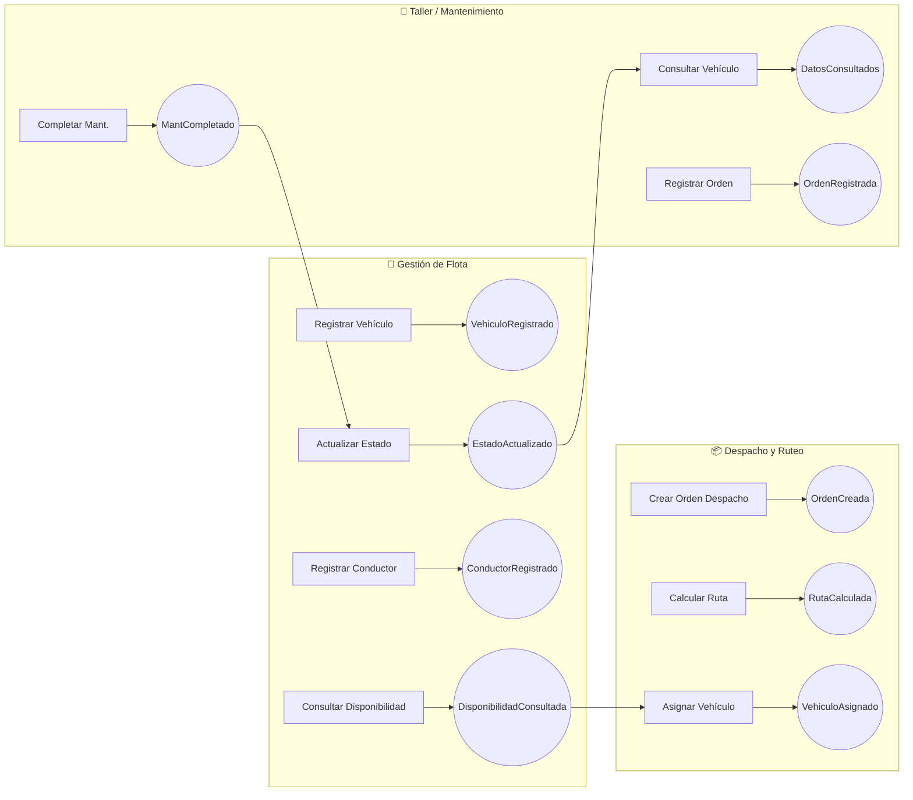
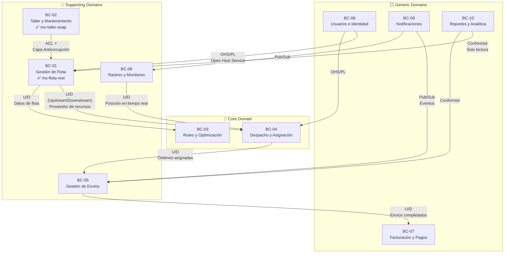

# 📘 Documento de Análisis DDD — LogiFlow

> Domain-Driven Design aplicado a la Plataforma de Gestión Logística

---

## 1. Problemática del Monolito Heredado

LogiFlow nace como solución a un **sistema monolítico heredado** de gestión logística que presentaba los siguientes problemas:

- **Acoplamiento extremo:** Cambios en el módulo de mantenimiento afectaban al de despacho.
- **Imposibilidad de escalar selectivamente:** Si el módulo de rastreo necesitaba más capacidad, se debía escalar toda la aplicación.
- **Base de datos compartida:** Una sola BD contenía tablas de todos los dominios, generando bloqueos y migraciones riesgosas.
- **Equipos bloqueados:** Los desarrolladores no podían desplegar cambios en su módulo sin coordinar con todos los demás.
- **Tecnología homogénea forzada:** No era posible usar SOAP para integraciones con talleres externos mientras el resto usaba REST.

---

## 2. Event Storming

El Event Storming nos permite descubrir los eventos de dominio clave y agruparlos en Bounded Contexts.

### 2.1 Eventos de Dominio Identificados

```
🟧 = Evento de Dominio (algo que ya sucedió en el negocio)
🟦 = Comando (acción que dispara el evento)
🟩 = Actor (quién ejecuta el comando)
```

| #  | Actor 🟩                   | Comando 🟦                           | Evento de Dominio 🟧                        |
|----|---------------------------|---------------------------------------|----------------------------------------------|
| 1  | Administrador de Flota    | Registrar Vehículo                    | `VehiculoRegistrado`                         |
| 2  | Administrador de Flota    | Actualizar Estado de Vehículo         | `EstadoVehiculoActualizado`                  |
| 3  | Administrador de Flota    | Registrar Conductor                   | `ConductorRegistrado`                        |
| 4  | Administrador de Flota    | Consultar Disponibilidad de Flota     | `DisponibilidadFlotaConsultada`              |
| 5  | Sistema de Ruteo          | Calcular Ruta Óptima                  | `RutaCalculada`                              |
| 6  | Despachador               | Crear Orden de Despacho               | `OrdenDespachoCreada`                        |
| 7  | Despachador               | Asignar Vehículo a Ruta               | `VehiculoAsignadoARuta`                      |
| 8  | Despachador               | Asignar Conductor a Ruta              | `ConductorAsignadoARuta`                     |
| 9  | Cliente                   | Solicitar Envío                       | `EnvioSolicitado`                            |
| 10 | Cliente                   | Consultar Estado de Envío             | `EstadoEnvioConsultado`                      |
| 11 | Sistema de Rastreo        | Actualizar Posición GPS               | `PosicionGPSActualizada`                     |
| 12 | Sistema de Rastreo        | Detectar Desvío de Ruta               | `DesvioRutaDetectado`                        |
| 13 | Taller Externo            | Consultar Datos de Vehículo           | `DatosVehiculoConsultados`                   |
| 14 | Taller Externo            | Registrar Orden de Mantenimiento      | `OrdenMantenimientoRegistrada`               |
| 15 | Técnico de Taller         | Completar Mantenimiento               | `MantenimientoCompletado`                    |
| 16 | Sistema de Facturación    | Generar Factura por Envío             | `FacturaGenerada`                            |
| 17 | Sistema de Facturación    | Registrar Pago                        | `PagoRegistrado`                             |
| 18 | Administrador             | Gestionar Usuario                     | `UsuarioCreado` / `RolAsignado`              |
| 19 | Sistema de Notificaciones | Enviar Notificación a Cliente         | `NotificacionEnviada`                        |
| 20 | Sistema de Reportes       | Generar Reporte de Operaciones        | `ReporteGenerado`                            |

### 2.2 Diagrama de Event Storming (Vista General)



---

## 3. Identificación de Dominios

### 3.1 Dominio Principal (Core Domain)

| Dominio            | Justificación                                                                |
|--------------------|-----------------------------------------------------------------------------|
| **Ruteo y Despacho** | Es el diferenciador competitivo de LogiFlow: optimizar rutas y despachos. |

### 3.2 Dominios de Soporte (Supporting Domains)

| Dominio                  | Justificación                                                     |
|--------------------------|-------------------------------------------------------------------|
| **Gestión de Flota**     | Provee los recursos (vehículos, conductores) al core domain.     |
| **Mantenimiento/Taller** | Mantiene la flota operativa. Integración con sistemas externos.  |
| **Rastreo y Monitoreo**  | Información en tiempo real que alimenta decisiones de ruteo.     |

### 3.3 Dominios Genéricos (Generic Domains)

| Dominio                  | Justificación                                                     |
|--------------------------|-------------------------------------------------------------------|
| **Gestión de Usuarios**  | Autenticación y autorización. Puede usarse una solución estándar.|
| **Facturación y Pagos**  | Proceso financiero estándar.                                     |
| **Notificaciones**       | Envío de alertas por múltiples canales.                          |

---

## 4. Definición de los 10 Bounded Contexts

### BC-01: Gestión de Flota (Fleet Management)

| Aspecto           | Detalle                                                                |
|-------------------|------------------------------------------------------------------------|
| **Responsabilidad** | CRUD de vehículos y conductores. Consulta de disponibilidad.         |
| **Entidades**     | `Vehiculo`, `Conductor`                                               |
| **Value Objects** | `Matricula`, `TipoVehiculo`, `EstadoVehiculo`                        |
| **Agregado Root** | `Vehiculo`                                                            |
| **Protocolo**     | REST (JSON)                                                           |
| **Estado Fase 1** | ✅ **Implementado** — `ms-flota-rest`                                 |

### BC-02: Taller y Mantenimiento (Workshop & Maintenance)

| Aspecto           | Detalle                                                                |
|-------------------|------------------------------------------------------------------------|
| **Responsabilidad** | Gestión de órdenes de mantenimiento. Integración con taller externo.|
| **Entidades**     | `OrdenMantenimiento`, `VehiculoTaller`                                |
| **Patrón DDD**    | **Anti-Corruption Layer** (Capa Anticorrupción)                       |
| **Protocolo**     | SOAP (XML/WSDL)                                                       |
| **Estado Fase 1** | ✅ **Implementado** — `ms-taller-soap`                                |

### BC-03: Ruteo y Optimización (Routing & Optimization)

| Aspecto           | Detalle                                                                |
|-------------------|------------------------------------------------------------------------|
| **Responsabilidad** | Cálculo de rutas óptimas considerando tráfico, distancia y capacidad.|
| **Entidades**     | `Ruta`, `PuntoDeEntrega`, `RestriccionRuta`                          |
| **Agregado Root** | `Ruta`                                                                |
| **Estado Fase 1** | 🔲 Planificado para Fase 2                                           |

### BC-04: Despacho y Asignación (Dispatch & Assignment)

| Aspecto           | Detalle                                                                |
|-------------------|------------------------------------------------------------------------|
| **Responsabilidad** | Crear órdenes de despacho, asignar vehículos y conductores a rutas. |
| **Entidades**     | `OrdenDespacho`, `Asignacion`                                        |
| **Agregado Root** | `OrdenDespacho`                                                       |
| **Estado Fase 1** | 🔲 Planificado para Fase 2                                           |

### BC-05: Gestión de Envíos (Shipment Management)

| Aspecto           | Detalle                                                                |
|-------------------|------------------------------------------------------------------------|
| **Responsabilidad** | Ciclo de vida del envío: solicitud → tránsito → entrega.            |
| **Entidades**     | `Envio`, `Paquete`, `Destinatario`                                   |
| **Agregado Root** | `Envio`                                                               |
| **Estado Fase 1** | 🔲 Planificado para Fase 2                                           |

### BC-06: Rastreo y Monitoreo (Tracking & Monitoring)

| Aspecto           | Detalle                                                                |
|-------------------|------------------------------------------------------------------------|
| **Responsabilidad** | Rastreo GPS en tiempo real, detección de desvíos y alertas.         |
| **Entidades**     | `PosicionGPS`, `AlertaDesvio`                                       |
| **Protocolo**     | WebSocket / Eventos en tiempo real                                    |
| **Estado Fase 1** | 🔲 Planificado para Fase 2                                           |

### BC-07: Facturación y Pagos (Billing & Payments)

| Aspecto           | Detalle                                                                |
|-------------------|------------------------------------------------------------------------|
| **Responsabilidad** | Generación de facturas, registro de pagos, estados de cuenta.       |
| **Entidades**     | `Factura`, `Pago`, `LineaFactura`                                    |
| **Agregado Root** | `Factura`                                                             |
| **Estado Fase 1** | 🔲 Planificado para Fase 2                                           |

### BC-08: Gestión de Usuarios e Identidad (Identity & Access)

| Aspecto           | Detalle                                                                |
|-------------------|------------------------------------------------------------------------|
| **Responsabilidad** | Autenticación, autorización, gestión de roles (RBAC).               |
| **Entidades**     | `Usuario`, `Rol`, `Permiso`                                         |
| **Patrón**        | Puede integrarse con Identity Provider externo (Keycloak, Auth0)     |
| **Estado Fase 1** | 🔲 Planificado para Fase 2                                           |

### BC-09: Notificaciones (Notifications)

| Aspecto           | Detalle                                                                |
|-------------------|------------------------------------------------------------------------|
| **Responsabilidad** | Envío de alertas y notificaciones multicanal (email, SMS, push).    |
| **Entidades**     | `Notificacion`, `PlantillaMensaje`, `CanalNotificacion`              |
| **Protocolo**     | Eventos asincrónicos (message broker)                                 |
| **Estado Fase 1** | 🔲 Planificado para Fase 2                                           |

### BC-10: Reportes y Analítica (Reports & Analytics)

| Aspecto           | Detalle                                                                |
|-------------------|------------------------------------------------------------------------|
| **Responsabilidad** | Generación de reportes operativos, dashboards, métricas KPI.        |
| **Entidades**     | `Reporte`, `MetricaKPI`, `FiltroConsulta`                            |
| **Patrón**        | CQRS (separar modelo de lectura para consultas analíticas)           |
| **Estado Fase 1** | 🔲 Planificado para Fase 2                                           |

---

## 5. Lenguaje Ubicuo (Ubiquitous Language)

El Lenguaje Ubicuo garantiza que desarrolladores, stakeholders y documentación usen exactamente los mismos términos.

### 5.1 Glosario Estructurado

#### Contexto: Gestión de Flota

| Término                | Definición                                                                                 | Uso en Código                    |
|------------------------|-------------------------------------------------------------------------------------------|----------------------------------|
| **Vehículo**           | Unidad de transporte registrada en la flota de LogiFlow.                                  | `Vehiculo.java`, `VehiculoDTO`   |
| **Matrícula**          | Identificador único alfanumérico de un vehículo (formato: `ABC-1234`).                    | `vehiculo.matricula`             |
| **Tipo de Vehículo**   | Categoría operativa: MOTO, AUTOMOVIL, FURGONETA, CAMION.                                 | `TipoVehiculo` enum              |
| **Estado del Vehículo**| Condición operativa actual: DISPONIBLE, EN_SERVICIO, MANTENIMIENTO.                      | `EstadoVehiculo` enum            |
| **Capacidad**          | Peso máximo de carga en kilogramos que soporta el vehículo.                               | `vehiculo.capacidad`             |
| **Conductor**          | Persona habilitada para operar vehículos de la flota.                                     | `Conductor.java`, `ConductorDTO` |
| **Cédula**             | Documento de identidad del conductor (10 dígitos numéricos).                              | `conductor.cedula`               |
| **Licencia**           | Tipo de permiso de conducción del operador.                                               | `conductor.licencia`             |
| **Disponibilidad**     | Indica si un recurso (vehículo o conductor) está apto para asignación inmediata.          | `conductor.disponible`, endpoint `/disponibles` |

#### Contexto: Taller y Mantenimiento

| Término                      | Definición                                                                          | Uso en Código                        |
|------------------------------|------------------------------------------------------------------------------------|--------------------------------------|
| **Orden de Mantenimiento**   | Registro formal de una incidencia o servicio preventivo sobre un vehículo.         | `OrdenMantenimiento.java`            |
| **Taller Externo**           | Proveedor de servicios de mantenimiento que opera fuera del dominio de LogiFlow.   | Integración SOAP                     |
| **Capa Anticorrupción (ACL)**| Patrón DDD que traduce y aísla el modelo interno del contrato del taller externo.  | `TallerTranslator.java`             |
| **Consultar Vehículo**       | Operación SOAP que permite al taller obtener datos de un vehículo por matrícula.   | `consultarVehiculo` (WSDL)           |
| **Registrar Orden**          | Operación SOAP para crear una nueva orden de mantenimiento.                        | `registrarOrdenMantenimiento` (WSDL) |

#### Contexto: Ruteo y Despacho (Fase 2)

| Término                | Definición                                                                          |
|------------------------|-------------------------------------------------------------------------------------|
| **Ruta**               | Secuencia ordenada de puntos de entrega optimizada por distancia y tiempo.          |
| **Orden de Despacho**  | Instrucción formal para enviar mercancía a través de una ruta asignada.             |
| **Punto de Entrega**   | Ubicación geográfica donde se debe entregar un paquete.                             |
| **Asignación**         | Asociación de un vehículo y un conductor a una orden de despacho.                   |

---

## 6. Context Map

El Context Map define cómo se relacionan los Bounded Contexts entre sí.

### 6.1 Diagrama del Context Map



### 6.2 Tipos de Relaciones

| Relación                      | Entre BCs                        | Descripción                                                          |
|-------------------------------|----------------------------------|----------------------------------------------------------------------|
| **Upstream/Downstream (U/D)** | Flota → Despacho                 | Flota provee datos de vehículos/conductores que Despacho consume.    |
| **Anti-Corruption Layer (ACL)** | Taller ↔ Flota                 | Taller traduce el modelo externo SOAP al modelo interno de Flota.    |
| **Open Host Service (OHS)**   | Usuarios → Flota, Despacho      | Usuarios expone una API estándar de autenticación para todos.        |
| **Published Language (PL)**   | Usuarios → Flota                 | Se usa JWT como lenguaje compartido de autenticación.                |
| **Conformist**                | Reportes ← Flota, Envíos        | Reportes se adapta al modelo de datos de otros BCs (solo lectura).   |
| **Pub/Sub (Eventos)**         | Notificaciones ← Envíos, Rastreo| Notificaciones reacciona a eventos publicados por otros contextos.   |

---

## 7. Resumen de Estado — Fase 1

| Artefacto                        | Estado     | Detalles                                         |
|----------------------------------|------------|--------------------------------------------------|
| Event Storming                   | ✅ Completo | 20 eventos identificados                          |
| Identificación de Dominios       | ✅ Completo | 1 Core, 4 Supporting, 4 Generic                   |
| 10 Bounded Contexts definidos    | ✅ Completo | Con entidades, agregados y protocolos              |
| Lenguaje Ubicuo                  | ✅ Completo | 3 contextos documentados con uso en código         |
| Context Map                      | ✅ Completo | Diagrama Mermaid con 6 tipos de relaciones         |
| ms-flota-rest (REST)             | ✅ Completo | CRUD + Disponibilidad + Swagger                    |
| ms-taller-soap (SOAP + ACL)     | ✅ Completo | 2 operaciones + WSDL + Capa Anticorrupción         |
| Pipeline CI/CD                   | ✅ Completo | GitHub Actions + SonarCloud + Telegram             |
| README con instrucciones         | ✅ Completo | Ejecución local + configuración de secretos        |
